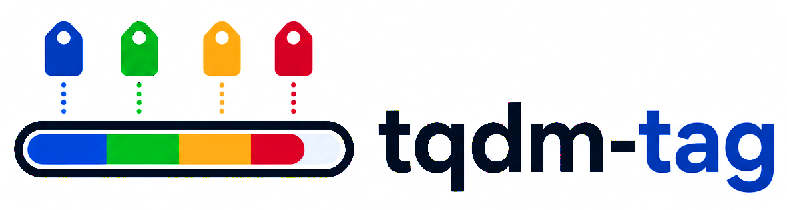
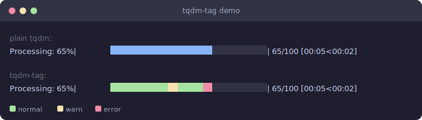

<p align="center">
  
</p>

# tqdm-tag

> Color-code individual items in a tqdm progress bar by tagging them with a status.

[](https://pypi.org/project/tqdm-tag/)
[](https://pypi.org/project/tqdm-tag/)
[](https://tqdm-tag.readthedocs.io)
[](LICENSE)

**tqdm-tag** extends [tqdm](https://tqdm.github.io/) so you can call `pbar.warn()` or `pbar.error()` on any item inside your loop. The corresponding segment of the progress bar fills with that tag's color, giving you an at-a-glance overview of where issues occurred — without waiting for the loop to finish.

---



*Top: plain tqdm (monochrome). Bottom: tqdm-tag coloring each processed item by outcome.*

---

## Installation

```bash
pip install tqdm-tag
```

## Usage

`TqdmErrorTag` is a drop-in replacement for `tqdm` — swap the class name and you're done. Call `.warn()` or `.error()` on any item to color that segment of the bar:

```python
from tqdm_tag import TqdmErrorTag

pbar = TqdmErrorTag(range(100), legend=True, desc="Processing")
for item in pbar:
    result = process(item)
    if result.has_warning: pbar.warn()
    if result.has_error:   pbar.error()
```

With `legend=True`, a live second line below the bar shows running counts:

```
Processing:  73%|████████████████████    | 73/100 [00:03<00:01, 12.5it/s]
■ warn: 4   ■ error: 1
```

### Custom tags with TqdmTag

For full control, use `TqdmTag` with `Tag` objects. Each `Tag` groups name, color, and an optional status integer (auto-assigned if omitted):

```python
from tqdm_tag import Tag, TqdmTag

pbar = TqdmTag(
    range(100),
    tags=[Tag("warn", color="yellow"), Tag("error", color="red")],
    legend=True,
)
for i in pbar:
    if i == 10: pbar.tag("warn")    # reference by name string
    if i == 80: pbar.tag("error")
```

### Add tags on the fly

Pass a `Tag` object directly to `.tag()` to register and apply it in one call. Subsequent calls can use the name string:

```python
from tqdm_tag import Tag, TqdmTag

pbar = TqdmTag(range(100))
for i in pbar:
    if i == 10: pbar.tag(Tag("warn",  color="yellow"))  # registers + applies
    if i == 30: pbar.tag("warn")                        # reuse by name
    if i == 80: pbar.tag(Tag("error", color="red"))
```

### Turn the whole bar green on success

```python
import time
from tqdm_tag import TqdmTag

items = range(50)
pbar = TqdmTag(items, colour="red")
for i in pbar:
    time.sleep(0.05)
    if i == len(items) - 1:
        pbar.tag("default", color="green")
```

### Customize the legend

Tags in the legend are ordered by status value. Pass a `legend_format` callable to take full control — it receives `tag_counts` (dict of name → count) and `tag_to_color` (dict of name → color):

```python
def my_legend(counts, colors):
    return "  ".join(f"[{k.upper()}={v}]" for k, v in counts.items())

pbar = TqdmErrorTag(range(100), legend=True, legend_format=my_legend)
```

### Reduce operation for dense bars

When the terminal is narrow, multiple items share one bar segment. Use `reduce_op` to control which status wins, and `reduce_ignore_default` to skip untagged items:

```python
from tqdm_tag import Tag, TqdmTag

pbar = TqdmTag(
    range(100),
    tags=[Tag("warn", color="yellow", status=1), Tag("error", color="red", status=2)],
    reduce_op=max,              # highest-severity status wins
    reduce_ignore_default=True, # don't let untagged items dilute the color
)
for i in pbar:
    if i % 10 == 1: pbar.tag("warn")
    if i % 10 == 2: pbar.tag("error")
```

## API

| Class | Description |
|---|---|
| `TqdmErrorTag` | Drop-in replacement with pre-wired `warn` / `error` tags and `.warn()` / `.error()` helpers |
| `TqdmTag` | Core class for fully custom tags |
| `Tag` | Dataclass grouping a tag's `name`, `color`, and `status` |
| `ColoredBar` | Internal `Bar` subclass that renders ANSI-colored segments |

Full API reference: **[tqdm-tag.readthedocs.io](https://tqdm-tag.readthedocs.io)**

## License

[MIT](LICENSE) © Colin Moldenhauer
